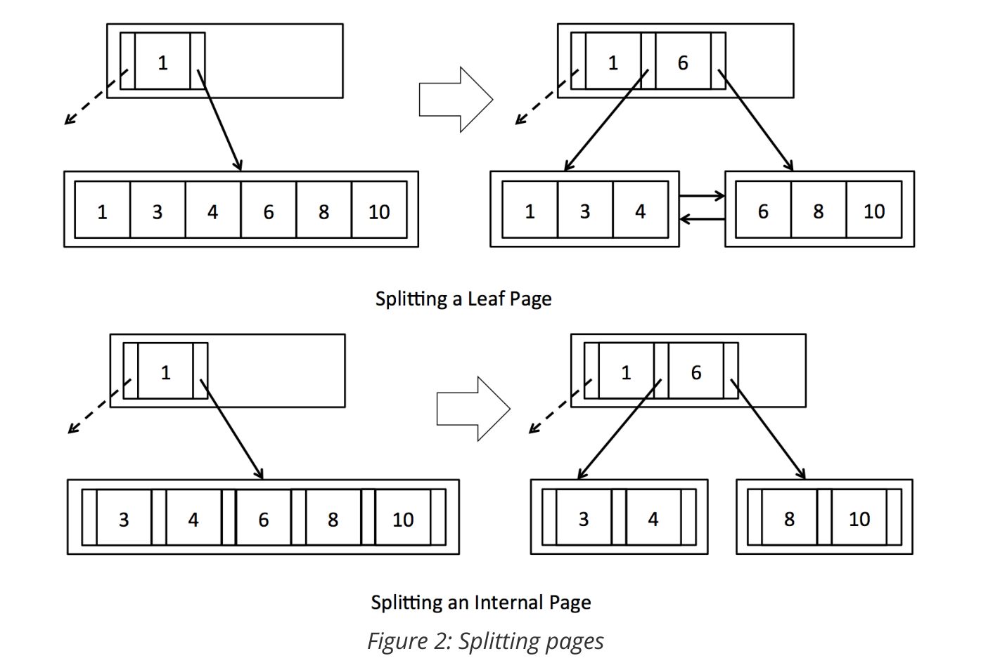

6.5831 Lab 5: B+ Tree Index

# 简介

在本实验中，您将实现一个B+树索引，用于高效的查找和范围扫描。我们为您提供了实现树结构所需的所有低级代码。您将实现搜索、分割页面、在页面之间重新分配元组和合并页面。

您可能会发现，回顾Alex Petrov的《数据库内核》第2章很有帮助，它提供了关于B+树结构的详细信息。

正如在课堂上讨论的，B+树的内部节点包含多个条目，每个条目由一个键值和一个左右子指针组成。相邻键共用一个子指针，因此包含m个键的内部节点有m+1个子指针。叶节点既可以包含数据项，也可以包含指向其他数据库文件中数据项的指针。为简单起见，我们将实现一个B+树，其中叶子页实际包含数据条目。相邻的leaf pages通过左右兄弟指针链接在一起，因此范围扫描只需要通过根节点和内部节点进行一次初始搜索就可以找到第一个leaf page。通过跟随右(或左)兄弟指针找到后续的叶页。


# Search

看看index/和BTreeFile.java。这是实现B+树的核心文件，您将在这里编写本实验的所有代码。与HeapFile不同，BTreeFile由四种不同的页面组成。正如您所期望的，树的节点有两种不同类型的页面:内页和叶页。内部页面在BTreeInternalPage.java中实现，叶子页面在BTreeLeafPage.java中实现。为了方便起见，我们在btrepage .java中创建了一个抽象类，其中包含叶页和内页通用的代码。此外，头页是在BTreeHeaderPage.java中实现的，并跟踪文件中的哪些页正在使用。最后，每个BTreeFile的开头都有一个页面，指向树的根页和第一个头页。这个单例页面在BTreeRootPtrPage.java中实现。熟悉这些类的接口，特别是BTreePage、BTreeInternalPage和BTreeLeafPage。您将需要在B+树的实现中使用这些类。


你的第一项工作是在BTreeFile.java中实现findLeafPage()函数。该函数用于在给定特定键值的情况下查找适当的leaf page，并用于搜索和插入。例如，假设我们有一个B+树，有两个leaf page(参见图1)。根节点是一个内部页，其中一个条目包含一个键(在本例中为6)和两个子指针。假设要找的值为1，该函数应该返回第一个叶页。

同样，给定值为8，该函数应该返回第二页。不太明显的情况是，如果给我们一个键值6。可能有重复的键，所以两个页上都可能有6。在这种情况下，函数应该返回第一个(左)叶页。


findLeafPage()函数应该递归搜索内部节点，直到到达与所提供的键值对应的叶页。为了在每个步骤中找到适当的子页，您应该遍历内部页中的条目，并将条目值与提供的键值进行比较。BTreeInternalPage.iterator()提供了使用BTreeEntry.java中定义的接口访问内部页面中的条目。这个迭代器允许您遍历内部页面中的键值，并访问每个键的左右子页id。当传入的BTreePageId有pgcateg()等于BTreePageId.LEAF 时，表示它是一个叶页。在这种情况下，您应该从缓冲池中获取页面并返回它。**您不需要确认它实际上包含所提供的键值f。**

findLeafPage()代码还必须处理提供的键值f为空的情况。如果提供的值为空，则每次递归最左边的子节点，以查找最左边的leaf page。找到最左边的leaf page对于扫描整个文件很有用。一旦找到正确的leaf page，就应该返回它。如上所述，您可以使用BTreePageId.java中的pgcateg()函数检查页面的类型。您可以假设只有叶页和内页将被传递给这个函数。

与其直接调用BufferPool.getPage()来获取每个内部页和叶页，我们建议调用我们提供的包装器函数BTreeFile.getPage()。它的工作方式与BufferPool.getPage()完全相同，但是需要一个额外的参数来跟踪脏页列表。在接下来的两个练习中，这个函数将非常重要，因为您将实际更新数据，因此需要跟踪脏页。

findLeafPage()实现访问的每个内部(非叶子)页都应该使用READ_ONLY权限获取，除了返回的叶子页，它应该使用作为函数参数提供的权限获取。这些权限级别对于这个实验室来说并不重要，但是它们对于代码在未来的实验室中正确运行很重要。


**Exercise1**

实现BTreeFile.findLeafPage()。

完成本练习后，您应该能够通过BTreeFileReadTest.java中的所有单元测试和BTreeScanTest.java中的系统测试。


# Insert

为了保持B+树的元组的排序顺序，并保持树的完整性，我们必须将元组插入包含封闭键范围的叶子页中。如上所述，findLeafPage()可用于查找应该插入元组的正确叶页。但是，每个页面都有有限数量的插槽，即使相应的叶页已满，我们也需要能够插入元组。

正如教科书中所描述的，试图将一个元组插入到一个完整的叶子页中应该导致该页被分割，以便元组均匀地分布在两个新页之间。每次叶页分割时，**<u>需要将与第二页中第一个元组对应的新条目添加到父节点</u>**。偶尔，内部节点也可能已满，无法接受新的条目。在这种情况下，父节点应该分离并向其父节点添加一个新条目。这可能会导致递归分裂，并最终创建一个新的根节点。

在本练习中，你将在BTreeFile.java中实现splitLeafPage()和splitInternalPage()。如果被分割的页是根页，您将需要创建一个新的内部节点来成为新的根页，并更新BTreeRootPtrPage。否则，您将需要获取具有READ_WRITE权限的父页，必要时递归地分割它，并添加一个新条目。

您会发现getParentWithEmptySlots()函数对于处理这些不同的情况非常有用。在splitLeafPage()中，你应该“复制”键到父页，而在splitInternalPage()中，你应该“推”键到父页。请参见图2，如果对这一点感到困惑，请复习课本中的10.5节。记得根据需要更新新页面的父指针(为了简单起见，我们在图中没有显示父指针)。当内部节点被拆分时，您需要更新所有被移动的子节点的父指针。您可能会发现updateparentpointer()函数对于这个任务很有用。此外，记得更新任何被分割的叶页的兄弟指针。最后，返回应该插入新元组或条目的页面，如所提供的关键字段所示。



在创建新页面时，无论是分隔页面还是创建新的根页面，都需要调用getEmptyPage()来获取新页面。这个函数是一个抽象，它允许我们重用由于合并而被删除的页面(下一节将介绍)。

我们期望您将使用BTreeLeafPage.iterator()和BTreeInternalPage.iterator()与叶子和内部页面进行交互，以遍历每个页面中的元组/条目。为了方便起见，我们还为这两种类型的页面提供了反向迭代器:BTreeLeafPage.reverseIterator()和BTreeInternalPage.reverseIterator()。这些反向迭代器在将元组/条目的子集从页面移动到其右兄弟时特别有用。

如上所述，内部页面迭代器使用BTreeEntry.java中定义的接口，该接口有一个键和两个子指针。它还有一个recordId，用于标识键和子指针在底层页面上的位置。我们认为一次处理一个条目是与内部页面交互的自然方式，但重要的是要记住，底层页面实际上并不存储条目列表，而是存储m个键和m+1个子指针的有序列表。

由于BTreeEntry只是一个接口，而不是实际存储在页面上的对象，更新BTreeEntry的字段不会修改底层页面。为了改变页面上的数据，你需要调用BTreeInternalPage.updateEntry()。此外，删除一个条目实际上只删除了一个键和一个子指针，所以我们提供了函数BTreeInternalPage.deleteKeyAndLeftChild()和BTreeInternalPage.deleteKeyAndRightChild()来显式地删除它。该条目的recordId用于查找要删除的键和子指针。插入一个条目也只插入一个键和一个子指针(除非它是第一个条目)，所以BTreeInternalPage.insertEntry()检查提供的条目中的一个子指针是否与页面上现有的子指针重叠，并且在该位置插入条目将保持键的排序顺序。


```java
    private void deleteEntry(BTreeEntry e, boolean deleteRightChild) throws DbException {
        RecordId rid = e.getRecordId();
        if (rid == null)
            throw new DbException("tried to delete entry with null rid");
        if ((rid.getPageId().getPageNumber() != pid.getPageNumber()) || 				  (rid.getPageId().getTableId() != pid.getTableId()))
            throw new DbException("tried to delete entry on invalid page or table");
        if (!isSlotUsed(rid.getTupleNumber()))
            throw new DbException("tried to delete null entry.");
        if (deleteRightChild) {
            markSlotUsed(rid.getTupleNumber(), false);
        } else {
            for (int i = rid.getTupleNumber() - 1; i >= 0; i--) {
                if (isSlotUsed(i)) {
                    children[i] = children[rid.getTupleNumber()];
                    markSlotUsed(rid.getTupleNumber(), false);
                    break;
                }
            }
        }
        e.setRecordId(null);
    }
```

分裂，添加，上递，修改父节点的指针；


警告:由于B+树是一个复杂的数据结构，在修改它之前，了解每个合法B+树的必要属性是有帮助的。

下面是一个非正式的列表:

- 如果父节点指向子节点，则子节点必须指向相同的父节点。
- 如果一个叶节点指向一个右兄弟节点，那么右兄弟节点又指向该叶节点作为左兄弟节点。
- 第一个和最后一个叶子必须分别指向空的左兄弟和右兄弟。

- 记录Id必须与它们实际所在的页面相匹配。
- 具有非叶子节点的节点中的键必须大于左子节点中的任何键，并且小于右子节点中的任何键。
- 具有子叶节点的键必须大于或等于左子节点中的任何键，小于或等于右子节点中的任何键。
- 一个节点的子节点要么全部是内部节点，要么全部是叶子节点。
- 非根节点不能小于半满。


**N.B.**

1. 检查器方法应该总是在初始化树之后，在开始和完成对键插入或删除的完整调用之前和之后通过，但不一定在内部方法中通过。
2. 树可能是结构良好的(因此通过checkRep())，但仍然是不正确的。例如，空树将始终传递checkRep()，但可能并不总是正确的(如果您只是插入一个元组，树不应该是空的)。

实现BTreeFile.splitLeafPage()和BTreeFile.splitInternalPage()。

完成本练习后，您应该能够通过BTreeFileInsertTest.java中的单元测试。您还应该能够通过systemtest/BTreeFileInsertTest.java中的系统测试。一些系统测试用例可能需要几秒钟才能完成。这些文件将测试您的代码是否正确插入元组和分割页面，并处理重复的元组。


# Delete

为了保持树的平衡和不浪费不必要的空间，B+树中的删除可能会导致页面重新分配元组(图3)或最终合并(参见图4)。您可能会发现回顾教科书中的10.6节很有用。


正如教科书中所描述的，试图从一个不足半满的叶页中删除一个元组会导致该页从它的兄弟姐妹中窃取元组或与它的兄弟姐妹之一合并。如果页面的一个兄弟页有多余的元组，元组应该均匀地分布在两个页面之间，父页的条目应该相应地更新(参见图3)。

但是，如果兄弟节点也处于最低占用状态，那么两个页面应该合并，并从父节点删除条目(图4)。反过来，从父节点删除条目可能会导致父节点不足一半满。在这种情况下，父节点应该从它的兄弟节点窃取条目，或者与一个兄弟节点合并。如果从根节点删除最后一个条目，则可能导致递归合并，甚至删除根节点。

在这个练习中，你将在BTreeFile.java中实现stealFromLeafPage()， stealFromLeftInternalPage()， stealFromRightInternalPage()， mergeLeafPages()和mergeInternalPages()。在前三个函数中，如果兄弟组有多余的元组/项，您将实现均匀地重新分配元组/项的代码。记住要在父节点中更新相应的键字段(请仔细查看图3中是如何做到这一点的——键在父节点中有效地“旋转”了)。在stealFromLeftInternalPage() / stealFromRightInternalPage()中，你还需要更新被移动的子节点的父节点指针。为此，您应该能够重用updateparentpointer()函数。

在mergeLeafPages()和mergeInternalPages()中，您将实现合并页面的代码，有效地执行splitLeafPage()和splitInternalPage()的反向操作。您会发现deleteParentEntry()函数对于处理所有不同的递归情况非常有用。确保在已删除的页面上调用setEmptyPage()，以使它们可用于重用。与前面的练习一样，我们建议使用BTreeFile.getPage()来封装获取页面的过程，并保持脏页面列表为最新。


为什么stealFromLeafPage参数没有事务id，但是Internal就有；


除了题目告诉我们的，我们需不需要设置其他页为dirty?


