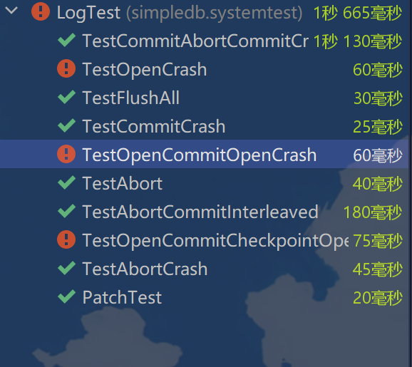

6.5831 Lab 6: Rollback and Recovery

# 0. Introduction

在本实验中，您将实现基于日志的中止回滚和基于日志的崩溃恢复。我们为您提供了定义日志格式的代码，并在事务期间的适当时间将记录追加到日志文件中。您将使用日志文件的内容实现回滚和恢复。

我们提供的日志代码生成用于物理整页撤销和重做的记录。当一个页面第一次被读入时，我们的代码将页面的原始内容记为前映像（before-image）。当一个事务更新一个页面时，相应的日志记录包含了修改前的前映像以及修改后的页面内容(后映像after-image)。您将使用前映像在中止期间回滚并在恢复期间撤消失败的事务，使用后映像在恢复期间重做成功的事务。

我们可以不做整个页面的物理UNDO(而ARIES必须做逻辑UNDO)，因为我们做的是页面级别的锁定，而且我们没有索引，这些索引在UNDO时的结构可能与日志最初写入时不同。页级锁简化事情的原因是，如果一个事务修改了一个页面，它必须对该页面具有独占锁，这意味着没有其他事务同时修改它，因此我们可以通过覆盖整个页面来撤销对它的更改。

BufferPool已经通过删除脏页实现了abort，并通过仅在提交时强制脏页到磁盘来假装实现原子提交。

日志记录允许更灵活的缓冲区管理(STEAL和NO-FORCE)，我们的测试代码在某些时刻调用BufferPool.flushAllPages()，以实现这种灵活性。


# 1. Getting started

你应该从你为实验5提交的代码开始(如果你没有为实验5提交代码，或者你的解决方案不能正常工作，请联系我们讨论选项。)

您需要修改一些现有的源代码并添加一些新文件。

下面是该怎么做:

- 现在，对现有代码进行以下更改:    在调用writePage(p)之前，将以下行插入BufferPool.flushPage()，其中p是对正在写入的页面的引用:

  ```java
  // append an update record to the log, with 
      // a before-image and after-image.
      TransactionId dirtier = p.isDirty();
      if (dirtier != null){
        Database.getLogFile().logWrite(dirtier, p.getBeforeImage(), p);
        Database.getLogFile().force();
      }
  ```

  这将导致日志系统对日志进行更新。我们强制日志以确保在将页面写到磁盘之前，日志记录在磁盘上。

- BufferPool.transactionComplete()对提交的事务弄脏的每个页面调用flushPage()。对于每一个这样的页面，在刷新页面后，添加一个对p.s etbebeimage()的调用:

  ```java
  // use current page contents as the before-image 
  // for the next transaction that modifies this page.
  p.setBeforeImage();
  ```

  在提交更新之后，需要更新页面的前映像，以便稍后中止回滚到此已提交的页面版本的事务。(注意:我们不能只在flushPage()中调用setBeforeImage()，因为即使事务没有提交，flushPage()也可能被调用。我们的测试用例实际上做到了这一点!如果通过调用flushPages()来实现transactionComplete()，则可能需要向flushPages()传递一个附加参数，以告诉它是否正在为提交的事务执行刷新。但是，在这种情况下，我们强烈建议您重写transactionComplete()来使用flushPage()。

- 在你做了这些更改之后，做一个干净的构建(ant clean;ant命令行，或者Eclipse中的“Project”菜单中的“Clean”。)

- 在这一点上，你的代码应该通过LogTest系统测试的前三个子测试，其余的都失败了; 

  ```bash
   $ ant runsystest -Dtest=LogTest
    ...
    [junit] Running simpledb.systemtest.LogTest
    [junit] Testsuite: simpledb.systemtest.LogTest
    [junit] Tests run: 10, Failures: 0, Errors: 7, Time elapsed: 0.42 sec
    [junit] Tests run: 10, Failures: 0, Errors: 7, Time elapsed: 0.42 sec
    [junit] 
    [junit] Testcase: PatchTest took 0.057 sec
    [junit] Testcase: TestFlushAll took 0.022 sec
    [junit] Testcase: TestCommitCrash took 0.018 sec
   [junit] Testcase: TestAbort took 0.03 sec
   [junit]     Caused an ERROR
   [junit] LogTest: tuple present but shouln't be
    ...
  ```

- 如果您没有看到ant runsystest -Dtest=LogTest的上述输出，则说明在提取新文件时出了问题，或者您所做的更改与现有代码不兼容。在继续之前，你应该弄清楚并解决问题;如有需要，请向我们求助。


# 2. Rollback

阅读LogFile.java中的注释，了解日志文件格式的描述。

```java
/**
 *
 * 文件的第一个长整数表示最后一个写入的检查点的偏移量，如果没有检查点，则为 -1
 *
 * 日志中的所有附加数据都由日志记录组成。日志记录的长度可变。
 *
 * 每个日志记录都以整数类型和长整数事务 ID 开头。
 *
 * 每个日志记录都以一个长整数文件偏移量结尾，表示日志文件中记录开始的位置。
 *
 *  有五种记录类型：ABORT, COMMIT, UPDATE, BEGIN, and CHECKPOINT
 *
 * ABORT、COMMIT和 BEGIN 记录不包含其他数据
 *
 * UPDATE记录由两个条目组成，一个是前映像，一个是后映像。
 * 这些图像是序列化的 Page 对象，可以使用 LogFile.readPageData（） 和 LogFile.writePageData（） 方法
 * 进行访问。有关示例，请参阅 LogFile.print（）。
 *
 * CHECKPOINT 记录由创建检查点时的活动事务及其在磁盘上的第一个日志记录组成。
 * 记录的格式是事务数的整数计数，以及每个活动事务的长整数事务 ID 和长整数首条记录偏移量。
 *
 * </ul>
 */
```

您应该在LogFile.java中看到一组函数，比如logCommit()，它们生成每种日志记录并将其附加到日志中。

您的第一项工作是在LogFile.java中实现rollback()函数。当事务终止时，在事务释放锁之前调用此函数。它的工作是撤销事务可能对数据库所做的任何更改。

rollback()应该读取日志文件，找到与终止事务相关的所有更新记录，从每个记录中提取前映像，并将前映像写入表文件。使用raf.seek()在日志文件中移动，使用raf.readInt()等来检查它。使用readPageData()读取每个前后图像。您可以使用映射tidToFirstLogRecord(它将事务id映射到堆文件中的偏移量)来确定从哪里开始为特定事务读取日志文件。您需要确保从缓冲池中丢弃了将其前映像写回表文件的任何页面。

在开发代码时，您可能会发现Logfile.print()方法对于显示日志的当前内容很有用。


实现LogFile.rollback()。

在完成这个练习之后，您应该能够通过LogTest系统测试的TestAbort和TestAbortCommitInterleaved子测试。


# 3. Recovery

如果数据库崩溃，然后重新启动，将在任何新的事务开始之前调用LogFile.recover()。你的实现应该:

1. 读取最后一个检查点(如果有的话)。

2. 从检查点(如果没有检查点，则从日志文件开始)向前扫描，以构建失败事务集。在此过程中重新进行更新。您可以安全地在检s查点启动重做，因为LogFile.logCheckpoint()将所有脏缓冲区刷新到磁盘。

3. 取消失败事务的更新。

实现LogFile.recover()。

在完成这个练习之后，您应该能够通过所有的LogTest系统测试。





